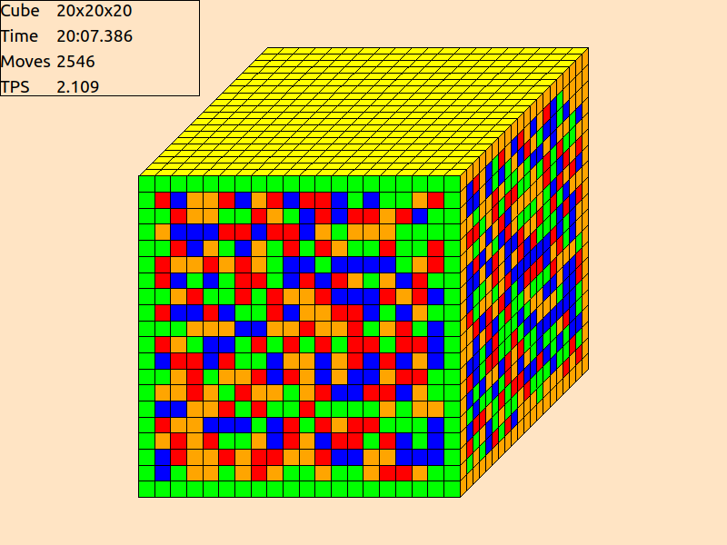

# cubesim

A Rubik's Cube simulator inspired by Michael Gottlieb's [isocubesim](https://mzrg.com/rubik/iso/).

## Requirements

  - Qt 5 (tested with 5.14.0)

## Download

[Here](http://benwh.000webhostapp.com/software/cubesim/).

## Build

    ./build.sh

## Features

  - Arbitrarily large cubes
  - Supercubes
  - Save files
  - Solve statistics and reconstructions
  - Customisable controls
  - Customisable cube projection
  - Video replays of finished solves (requires FFmpeg)
